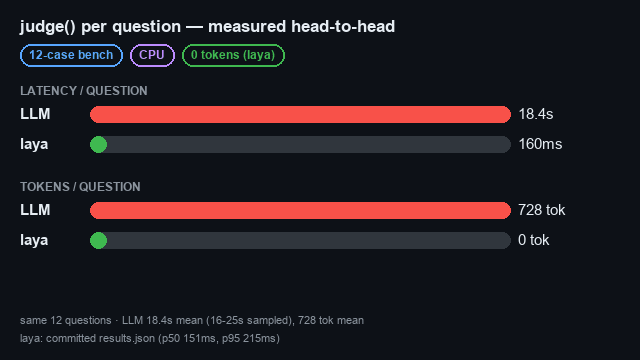
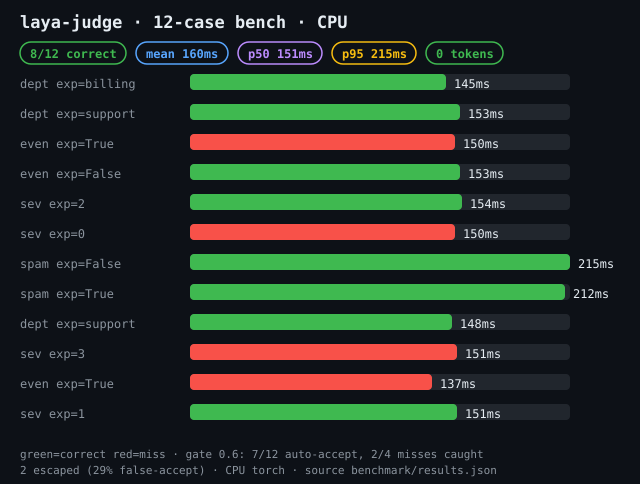
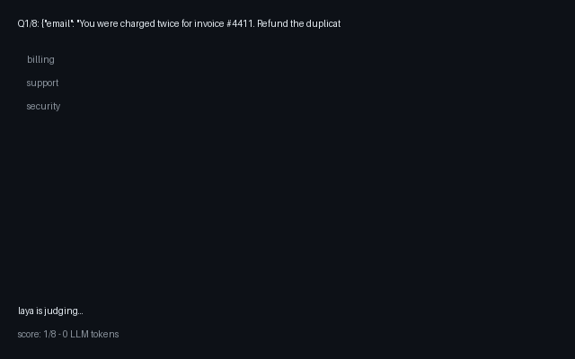
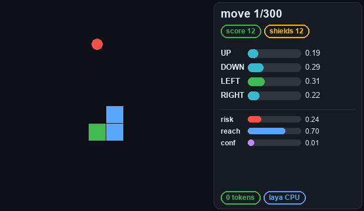
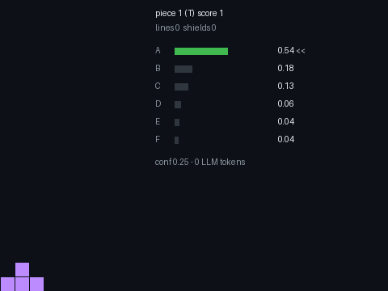

# omp-laya-judge

Local System-1 judge for [oh-my-pi](https://github.com/can1357/oh-my-pi),
powered by [laya](https://github.com/NandhaKishorM/laya). Typed decisions
(`choice`/`bool`/`score`) at **mean 160ms (p50 151ms, p95 215ms)** on CPU,
**0 LLM tokens burned**, nothing leaves the machine.



## Measured head-to-head

Same 12 classification questions, real model via `omp -p` vs this plugin
on CPU, no GPU:

| | LLM `judge()` | laya-judge |
|---|---|---|
| latency / question | 18.4s (16–25s sampled) | mean 160ms (p50 151ms, p95 215ms) |
| tokens / question | 728 | 0 |
| accuracy (12-case bench) | n/a (reference) | 8/12 |

Reproduce everything below from committed artifacts:

```sh
python benchmark/run.py           # -> benchmark/results.json (schema 2)
python benchmark/calibrate.py     # -> benchmark/calibration.json (gate metrics)
python benchmark/chart.py         # -> assets/benchmark.svg
python benchmark/before_after.py  # -> assets/before-after.gif
```

## The 0.6 gate, honestly

Policy: answers with confidence ≥ 0.6 are auto-accepted, below escalates
to the LLM. What that bought on the 12-case bench
(`benchmark/calibration.json`, computed — not asserted):

- **auto-accept 7/12**, 5 escalated to the LLM
- 4 misses total: **2 caught by the gate**, 2 escaped
- **false-accept 29%** (2 of the 7 auto-accepts were wrong)

Both escapes are parity questions at confidence 0.80/0.84 — the model is
confidently wrong on arithmetic. Confidence alone does not save you
there, which is why `rules/laya-auto.md` and the skill exclude
arithmetic/parity questions from auto-accept and route them to the LLM
regardless of confidence.

## Checkpoint A/B/C + random

(`benchmark/compare.json`, reproduced by `benchmark/compare_models.py`):

| | EN 12-case | TR 4-case | mean conf | mean ms |
|---|---|---|---|---|
| english | 8 | 2 | 0.68 | 210 |
| typed-decisions | 8 | 3 | 0.54 | 198 |
| multilingual | 6 | 2 | 0.76 | 111 |
| random (coin flip) | 6 | 0 | — | 0 |

TR sample is small (4); the honest read is laya >> chance (2–3 vs 0), not
a checkpoint coronation.



## Demos



Grounded quiz (`python demo/quiz.py`): **6/8, mean 282ms, 0 tokens** —
both misses came in under 0.2 confidence, exactly the cases the escalate
rule covers.



Snake (`python demo/snake.py`): **score 12, 300 moves, alive, 12 shield
interventions, ~0.9s/move on CPU, 0 tokens**. Watch every decision in the
browser: open `web/snake.html` (canvas replay with live probability bars,
play/pause/speed/scrub); quiz at `web-quiz.html`. Recipe (from
[laya-mlx](https://github.com/mizorewww/laya-mlx)): a deterministic planner
describes each direction over a tiny state (`Safe route: yes. Food reachable:
…`), a safety shield executes the best SAFE move. Short parallel criteria are
the whole trick — greedy end-to-end choice without the planner scores 0 (see
`demo/snake.py` header for the measured failure modes). Honest calibration:
per-move confidences on game states run at noise level (0.005-0.05; the quiz
gets 0.2-1.0 on text) — navigation is planner + shield with laya ranking, the
same division of labor as laya-mlx. The maze variant (`demo/maze.py`) is a
documented negative: corridors trap the noise walk (1 crumb/200 steps).



Tetris (`python demo/tetris.py`): **score 5720, 43 lines, 120 pieces, alive,
~1s/placement on CPU, 0 tokens**. Per piece the planner enumerates every
legal landing, shortlists 6 by classic features (lines, holes, height,
bumpiness), laya picks one in a batched call, and a shield keeps the stack
out of the top-4 danger zone. Replay in browser: `web/tetris.html` (colored
board, candidate cards with live probabilities, scrub).

## Languages

The server routes per request: Latin script → `english`, everything else →
`multilingual` (one extra ~0.7GB download, then cached). Turkish works today
(e.g. fatura/departman routing correct) but with lower confidence than
English — the same 0.6 gate applies. To pin a checkpoint, set `LAYA_MODEL`
in `.mcp.json`'s `env`; the manifest ships unpinned because pinning
disables routing.

## Install (step by step)

Requirements: Python 3.10+, `pip`, ~3GB disk (checkpoints), oh-my-pi.

```sh
pip install -r server/requirements.txt   # laya==0.3.20, mcp<2, torch, transformers>=4.48,<5
omp plugin marketplace add F0Rextasy/omp-marketplace
omp plugin install laya-judge@forextasy  # or: omp plugin link ./omp-laya-judge
omp plugin list                          # laya-judge should show ● enabled
```

Verify inside omp:

```text
Call the tool mcp__laya-judge__judge_info and reply with its exact JSON output.
```

Expected: `{"model": "laya/auto", "device": "cpu", "loaded": true, ...}`.
First start imports torch and loads the checkpoint (~10s warm, longer on a
cold machine while both checkpoints download — the manifest ships
`timeout: 600000` for exactly that), then ~0.16s per judgment.

Troubleshooting (all hit during development, all fixed in this repo):

- `transformers` < 4.48 cannot load ModernBERT → pin `transformers>=4.48,<5`.
- `mcp>=2` renamed FastMCP → pin `mcp<2`.
- On Windows, torch init order matters → the sidecar binds first, loads the
  router on a background thread, and keeps answering `judge_info`
  (`loaded:false`, then `startup_error` instead of hanging if it fails).
  Measured: ~20s to `loaded:true` on CPU.
- `python.EXE`/`py.EXE` uppercase spawn failures → use the shipped `.cmd` wrapper.

## Use

The plugin exposes `mcp__laya-judge__judge(state, questions)` plus the
`laya-judge` skill (triage → pre-filter → escalate). Question shapes mirror
oh-my-pi's eval `judge()`:

- `choice`: `criteria: {label: rubric}` → `{choice, probabilities, confidence}`
- `bool`: yes/no statement → `{bool: P(true)}` (laya `noul` head is `[false, true]`)
- `score`: `criteria: [lowest … highest]` → `{score, legend, probabilities, confidence}`

Every reply carries `model` (`laya/english` or `laya/multilingual`, derived
from laya's own routing block), per-call `latency_ms`, and laya's `usage`/
`routing` block so provenance survives in the transcript.

## Tests

```sh
python -m unittest discover -s . -t . -p "test_*.py"             # fast suite (CI)
LAYA_SLOW_TESTS=1 python -m unittest discover -s . -t . -p "test_*.py"   # + model/stdio/routing/concurrency
```

The fast suite pins the mapping layer, the HTTP sidecar contract, repo
hygiene (requirements/license/versions/manifest), and — via
`tests/test_readme_lint.py` + `tests/test_calibration.py` — that every
number on this page still matches the committed JSON. The slow suite needs
cached checkpoints: accuracy floor, MCP stdio handshake against a spawned
server, non-Latin routing, Turkish diacritics, and parallel judgments.

## laya as the harness's judge (System One)

oh-my-pi resolves typed judgments through a `judge` role chain. A candidate
whose API is a judgment API is a *native System One backend* — the same slot
TypeSafe's `jev` and OpenRouter's Decisions API occupy. laya already speaks
that wire protocol (`state` + `noul`/`choice`/`score` → typed `answers`), so
the integration is not a shim: the sidecar answers the harness's own
decisions.

```sh
# one-time, user environment (Windows shown)
setx TYPESAFE_BASE_URL http://127.0.0.1:3777
setx TYPESAFE_API_KEY laya-local
# then, in ~/.omp/agent/config.yml:
#   modelRoles:
#     judge: typesafe/jev-latest
```

`GET /v1/models` feeds oh-my-pi's discovery, so the sidecar's checkpoints
appear as native judge models:

```console
$ omp models --kind=judge
typesafe (3)
├── english        # discovered from the sidecar
├── jev-latest     # bundled seed, baseUrl redirected to the sidecar
└── multilingual   # discovered from the sidecar
```

With that set, laya answers the harness's decisions itself — the main model
never calls a judge tool. Verified live: the `find` cascade sent
`systemone: 58 question(s)` straight from oh-my-pi to the sidecar.

**Where laya wins, measured.** 1 question answers in 0.3–0.8s with zero API
tokens; the same judgment through a chat model costs seconds and tokens.

**Where it loses, measured.** laya is ~100ms per question on CPU, so wide
batches lose to one remote call: 58 questions take 8.6s locally. The sidecar
chunks requests at 8 and merges them to stay inside the harness's 10s
judgment budget, but the `find` cascade issues many such batches per search,
which is why this setup ships `find.enabled: off`. Re-enable it on faster
hardware, or keep the cloud judge for that one path.

Because a ChainJudge timeout *throws* instead of falling through, the sidecar
refuses pathological requests (over `LAYA_MAX_TOTAL_QUESTIONS`, default 256)
with a non-transient 422 instead of hanging on the model lock.

**You see the choices.** The sidecar keeps a ring buffer of every System One
answer (`GET /v1/decisions?since=N`) and the turn-end card pulls what the
harness picked, so laya's own decisions read like any other call:

```text
⚡ laya ▸ 2 decisions this turn — level=xhigh · stopped=0.23 · avg 254ms
```

Without it the native judge role was silent — the harness calls laya
directly, so no tool result ever reached the transcript.

## The decision layer (harness-side)

The plugin no longer waits to be called. `hooks/pre/laya-decide.ts` asks the
sidecar directly at the points a keel-style selector would, and every gate is
**fail-open**: a timeout, a dead sidecar, or a malformed reply means no
decision, never a block.

| # | Event | Decision | Acts at |
|---|---|---|---|
| D1 | `session_start` / `before_agent_start` | health-check, respawn the sidecar (throttled 60s) | always |
| D2 | `tool_call` (bash) | is this command destructive? | warn ≥0.6, block ≥0.85 |
| D3 | `tool_call` (task) | mechanical work → `sonic`? | ≥0.6 |
| D4 | `tool_result` (error) | which recovery path? + escalate effort? | ≥0.6 |
| D5 | `session_stop` | is the task actually finished? | P<0.6 → one continuation |
| D6 | `session.compacting` | which context categories to preserve | ≥0.6 |
| D7 | `before_agent_start` | which project notes are relevant | ≥0.6 |
| D8 | `tool_call` (bash) | run focused checks before the full suite | ≥0.6, once per turn |

D2 and D8 only ask after a prefilter match (destructive/privileged/network/
kill/force-push patterns; bare full-suite runners), so ordinary commands cost
zero. The sidecar self-exits after 10 idle minutes; the next prompt respawns it.

### Measured gate behaviour (this is the honest part)

Probed against the shipped `laya/english` checkpoint on CPU, 16-command risk
set and the recovery/routing/note gates:

- **D2 carries real signal.** Destructive commands score 0.43–0.78
  (mean 0.64); ordinary read commands 0.12–0.34 (mean 0.22). Of four
  question framings tested, the long statement used here separated best.
- **D2 cannot rank deletions.** Routine cleanup (`rm -rf build` 0.68) and
  catastrophe (`rm -rf /` 0.75) overlap almost completely. No threshold
  separates them: 0.6 flags 5/8 routine commands, 0.8 catches nothing. That
  is why the block bar stays at 0.85 — the shipped checkpoint never reaches
  it, and the live behaviour is a caution, not a stop. Enriching the state
  with harness-extracted features made it *worse* (measured), so it is not done.
- **D3, D4, D5, D8 are noise on this checkpoint** — confidence 0.01–0.30, and
  D3 inverts ("find why auth drops sessions" routes to `sonic`). They stay
  wired at the 0.6 gate, which they do not clear, so they cost one cheap
  round-trip and change nothing today. They become live if a stronger
  checkpoint is selected — re-measure before trusting them, exactly as
  `LAYA_MODEL` pinning changes the calibration.

In short: the wiring is real and measured, and on the shipped checkpoint the
only gate that acts is the destructive-command caution. Treat the rest as
instrumented infrastructure, not as behaviour you should rely on.

## Layout

- `.mcp.json` — stdio server declaration (unpinned, `timeout: 600000`)
- `server/bridge.py` — thin FastMCP stdio bridge; no model imports
- `server/core.py` — pure mapping (no torch), batch + unpack layer
- `server/sidecar.py` — sole model owner and HTTP sidecar (`POST /judge`, `GET /info`)
- `server/laya-judge.cmd` — Windows launcher
- `skills/laya-judge/SKILL.md` — when to use / when to escalate
- `rules/laya-auto.md` — auto-routing rule (arithmetic excluded)
- `commands/laya.md` + `hooks/pre/laya*.ts` — `/laya` status command, startup banner, live decision feed
- `hooks/pre/laya-decide.ts` + `hooks/lib/record.ts` — the harness-side decision layer (8 gates) and the shared decision queue behind the turn-end card
- `benchmark/` — reproducible accuracy + latency + gate proof
- `demo/` — quiz/snake/tetris + maze (all seeded, `*-stats.json`),
  rendered through the shared `demo/style.py` look
- `tests/` — fast + slow suites; `.github/workflows/test.yml` runs fast
- `assets/` — `before-after.gif`, `benchmark.svg`, `quiz.gif`, `snake.gif`, `tetris.gif`

## License

MIT
